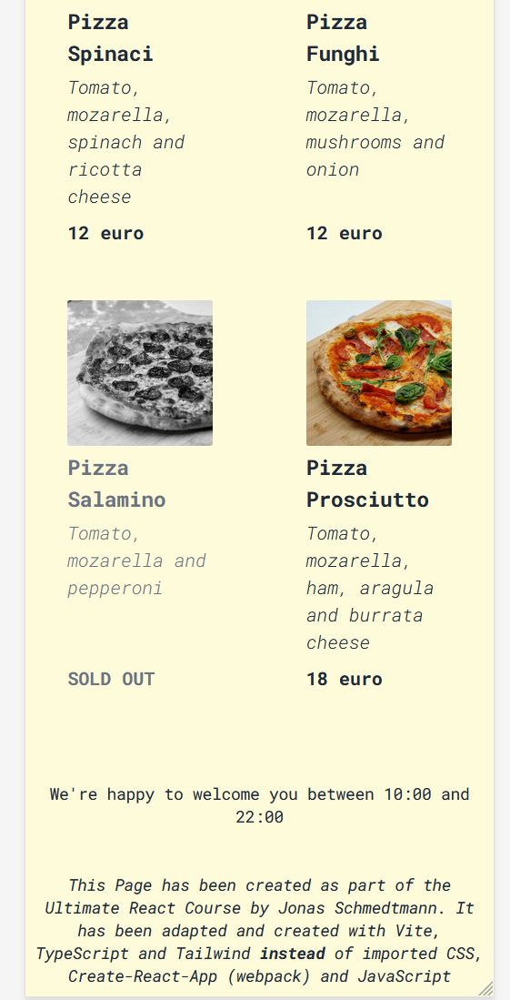

# Overview

This project has been created as part of the Ultimate React Course by Jonas Schmedtmann. It has been adapted and created with Vite, TypeScript and Tailwind **instead** of imported CSS, Create-React-App (webpack) and JavaScript which was used in the course.

## Images

### Mobile

### Desktop

